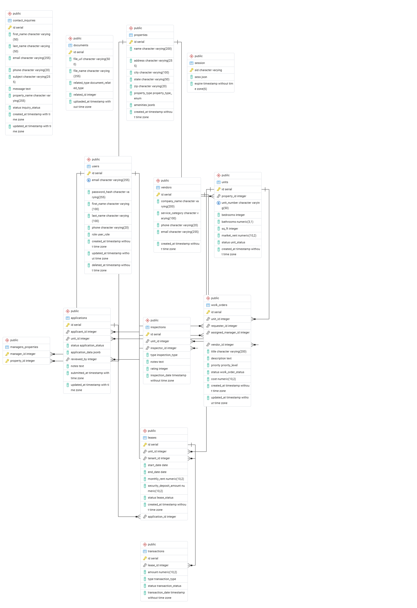

# Havn Property Management

## 1. Project Description
**Havn** is a comprehensive property management platform designed to streamline the relationship between property owners and their residents. The application serves two primary purposes:
* **For Havn Management:** To provide a centralized dashboard for tracking maintenance requests, managing communication with prospective tenants, and overseeing user accounts.
* **For Tenants:** To offer a self-service portal where they can manage their rental experience, view lease details, and maintain their personal profiles.

---

## 2. Database Schema
Below is the Entity Relationship Diagram (ERD) representing the database structure, including tables for users, properties, maintenance logs, and messages.

*Note: Please ensure your exported pgAdmin image is saved in the repository and the path above is updated accordingly.*

---

## 3. User Roles
The system utilizes three distinct roles to manage permissions and access:

### **Tenant**
* **Lease Management:** View current lease agreements and related documents.
* **Maintenance:** Create new maintenance requests and cancel existing ones if they are no longer needed.
* **Public Access:** Access and submit general contact forms without needing to be logged in.
* **Profile Management:** Edit and update personal profile information once authenticated.

### **Manager**
* **Maintenance Oversight:** View all submitted maintenance requests across the platform and update their status through various stages of completion.
* **Inquiry Management:** Access and respond to messages sent via the public contact forms from prospective tenants.

### **Admin**
* **Full Access:** Includes all permissions granted to both Tenants and Managers.
* **User Administration:** View and edit all user accounts within the system.
* **Residency Approval:** Review, approve, or deny applications/requests to live at managed properties.

---

## 4. Test Account Credentials
To test the various permission levels of the application, please use the following accounts. 

**Note:** For security purposes, the specific password is not listed here, though a universal password has been applied to all test accounts for grading purposes.

| Role    | Email Address           |
| :---    | :---                    |
| Admin   | dlmcburrito@gmail.com   |
| Manager | manager1@propco.com     |
| Tenant  | lukehill@gmail.com      |

---

## 5. Known Limitations
* **CSS Loading Issue:** There is a known intermittent bug where CSS styles may fail to load on the initial page render. This is currently linked to database connection issues.
* **Workaround:** If the site appears unstyled, a simple page refresh typically resolves the issue and loads the stylesheets correctly. This behavior emerged following the database issues.
